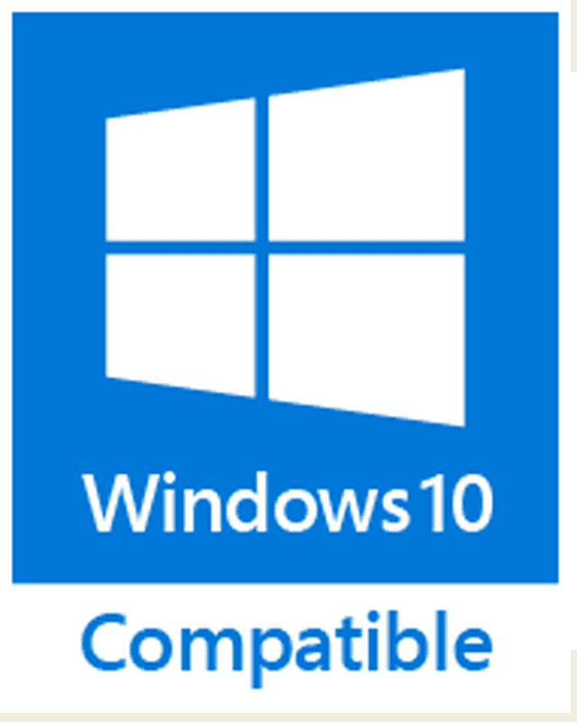
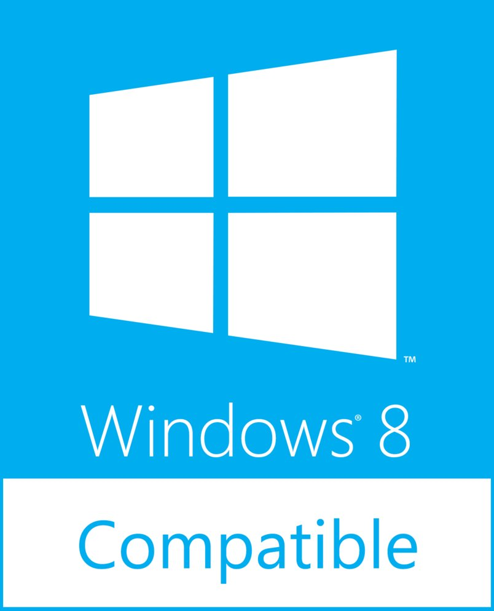
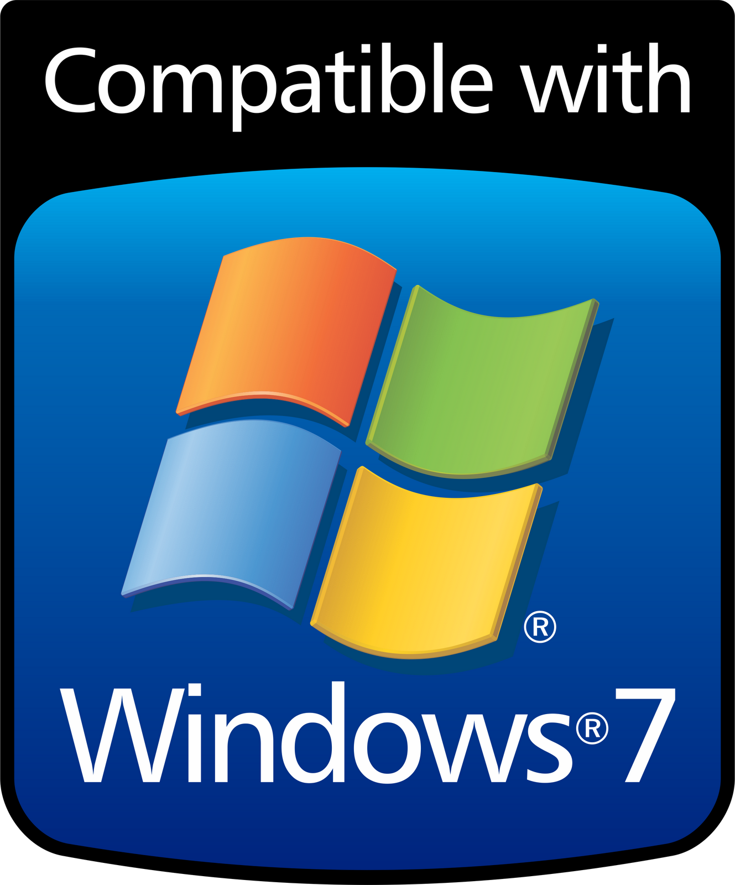

# windows-music-library

Range of pre-calculated notes using the windows.h file function [Beep()](https://msdn.microsoft.com/en-us/library/windows/desktop/ms679277(v=vs.85).aspx). This was created due to an earlier project of mine, [16th & Oak](https://github.com/aManNamedTed/16th-Oak), where I made a small melody in the opening scene of the game while referencing [this resource](https://pages.mtu.edu/~suits/notefreqs.html). I also screenshotted the reference and stored it in the [img](img) directory in case the reference is renamed or deleted. 

The hope is to open-source this library to others to play around with and make their own music. Happy composing!

## Compatibility

<p float="left" text-align="center">
  
  
  
</p>

## Requirements

0. Use a Windows PC or virtual machine with Windows 7, Windows 8, or Windows 10 installed.
1. Clone the repository onto said Windows PC or virtual machine.
2. Make sure you have a C++ compiler and text editor installed on your Windows PC or virtual machine.

## Usage

Check out the sample music in the "sampleMusic" directory for how to format your files.
Don't forget to compile and run on a machine using Windows 10, Windows 8, or Windows 7 and your favorite C++ compiler or IDE.

> <b>Note:</b> 
> <i>
>   Remember that the [88-key range of a piano](img/piano_organ_range.jpg) is A0 to C8 (inclusive). So if your computer is 
>   able to compile and run the library as-is with no audible output, try a different note in the middle of the range or 
>   increase the length of the tone.
> </i> 

## Getting Started
### Method 1: Using [Dev-C++](https://sourceforge.net/projects/orwelldevcpp/) (IDE)

0. Complete the [Requirements](#requirements) section above.
1. Click this link https://sourceforge.net/projects/orwelldevcpp/ to go to the Dev-C++ download page.
2. Download Dev-C++.
3. Open Dev-C++.
4. Navigate to File > New > Project...
5. Click the Basic tab.
6. Click Console Application.
7. Select C++ Project.
8. Name your project something fun, then click OK.
9. Navigate to the directory you want to save your project in and click Save.
10. In the view on the left, click the Project tab.
11. Right click your project.
12. Select Add To Project...
13. Navigate to the src directory within the library.
14. Add both WinMusLib files--they serve different purposes, I promise-- and click Open.
15. Do steps 12-14, but instead add the file from yourMusic/yourFirstSong.cpp.
16. Insert a few of your favorite notes.
17. Click Execute > Compile & Run or press F11. 
> <i>If step 17 does not work, read the</i> <b>Note:</b> <i>in the [Usage](#usage) section.</i>
18. Repeat steps 16-17 until satisfied. (Good luck!)

### Method 2: Using the [MinGW](https://sourceforge.net/projects/mingw/files/OldFiles/) and Command Line (CMD)

0. Complete the [Requirements](#requirements) section above.
1. Install the [MinGW Compiler](https://sourceforge.net/projects/mingw/files/OldFiles/).
2. Click start or press the Windows key, and type "cmd", and hit enter.
3. Type the command below and press enter.
```bash
  gcc --version
```
the above command should show the following:
```bash
  gcc (MinGW.org GCC-6.3.0-1) 6.3.0
  Copyright (C) 2016 Free Software Foundation, Inc.
  This is free software; see the source for copying conditions. There is NO
  warranty; not even for MERCHANTABILITY or FITNESS FOR A PARTICULAR PURPOSE.
```
> If you see,
> ```bash
>   'gcc' is not recognized as an internal or external command, operable program or batch file.
> ```
> Then it means you need to create another environment variable. <br/>
> 3a. Click start or press the Windows key, and type "environment variable" and press enter. <br/>
> 3b. Click "Environment Variables...". <br/>
> 3c. In the System variables box, double click on the Path variable. <br/>
> 3d. Click New. <br/>
> 3e. Type in the path to your MinGW folder. Should look like "C:\MinGW\bin". <br/>
> 3f. Click OK, then OK again, and open up cmd. <br/>
> 3g. Retry Step 3 above.
4. Using your favorite text editor, write a song to the file yourMusic/yourFirstSong.cpp.
5. Press the Windows key, type "cmd" and press enter.
6. Navigate to the windows-music-library/yourMusic directory.
```bash
  dir       # to print the contents of your current directory  
  cd <dir>  # to change directory to the <dir>ectory
  
  # example usage of cd
  cd ~/Downloads/windows-music-library/yourMusic
```
7. Compile your song file with the windows-music-library.
```bash
  gcc yourFirstSong.cpp ../src/winMusLib.cpp
```
> To create a custom-named executable file, use this instead:
> ```bash
>   gcc yourFirstSong.cpp ../src/winMusLib.cpp -o customNamedSong
> ```

8. Run your executable file and listen to an awesome song!
```bash
  a.exe
```

> To run your custom-named executable file, use this command:
> ```bash
>   customNamedSong
> ```

> <b>Optional</b>: Try creating a makefile to automate this process. (Google it!)

## Contributing

If you're set on contributing, feel free to say hi@davidamante.com.

## Versioning

I use [SemVer](http://semver.org/) for versioning. For the versions available, see the [tags on this repository](https://github.com/aManNamedTed/windows-music-library/tags). 

## Authors

* **David Amante** - *Initial work* - [aManNamedTed](https://github.com/aManNamedTed)

See also the list of [contributors](https://github.com/your/project/contributors) who participated in this project.

## License

This project is licensed under the MIT License - see the [LICENSE.md](LICENSE.md) file for details

## Acknowledgments

* Thanks for still using hardware beeps, [Microsoft](https://github.com/Microsoft).
* Special thanks to [@NickFever](https://twitter.com/NickFever?lang=en) for giving me the [beats-per-minute to note-duration calculation](http://nickfever.com/music/blog/2014/bpm-to-ms).
